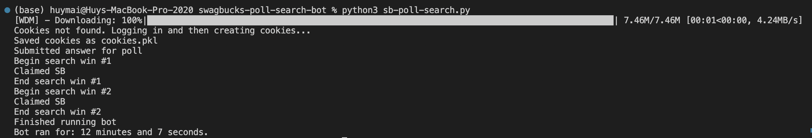

# Swagbucks Poll and Search Bot

(Use at your own risk, I'm not responsible if anything happens to your account)

A bot to help you complete your daily Swagbucks poll for 1 SB and your two daily search wins for around 10 SB+ in ~10-11 minutes. This should earn you 10+ SB every day if you run `sb-poll-search.py` or `sb-poll-search-2.py`. If you want to have more control over the bot, then run `sb-poll-search-2.py`. There is a possibility that you can get three daily search wins in one day if you run both `sb-poll-search.py` and `sb-poll-search-2.py`. Note that you might have to manually enter a captcha code to claim SB on your search wins. If the bot doesn't claim the SB for some reason, then try to delete the `cookies.pkl` file and rerun the bot.



## Setup the bot

### Requirements

```
$ pip install -r requirements.txt
```

### config.py

```
$ touch config.py
```
Copy the contents of `config-example.py` into `config.py`. <br/>

```
EMAIL = "your email"
PASSWORD = "your password"
```

Replace the `EMAIL` and `PASSWORD` fields with your account email and password.


## Run the bot

more automated
```
$ python3 sb-poll-search.py
```

or more manual
```
$ python3 sb-poll-search-2.py
```

Click on the 'Claim My SB' button when it pops up on your page if you run `sb-poll-search-2.py`

## License

This project is licensed under the MIT License - see the [LICENSE](LICENSE) file for details